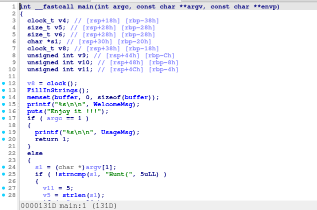
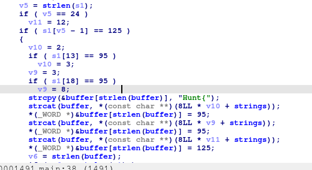
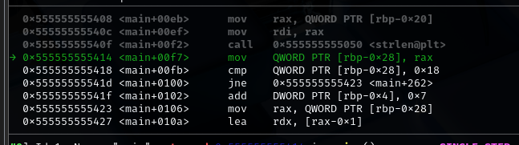
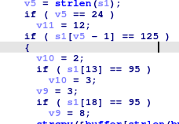
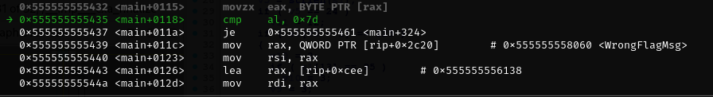
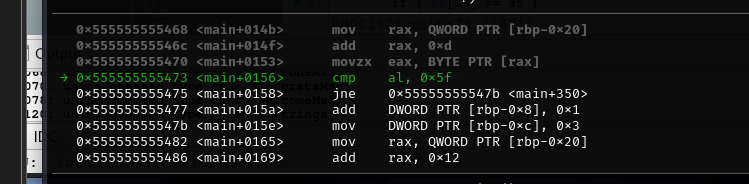
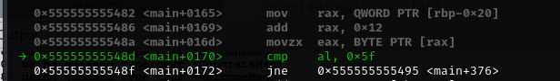
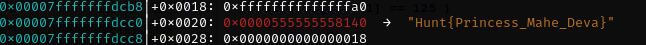

  

Author Note:
```
This challenge i refer to ctflearn , basically to replace bypass ( i totally handcraft it but i am too bodoh cuz the chal got prob ) thus i refer to other ctf challenge .

This challenge is just wan u guys to use dynamic tools to reach a certain condition to get the correct flag , I'm sry somehow got a little bug with the problem .
```

### Writeup 

1. first we use ida to decompile it 

2. 

3. thr we found thr is a argument thus it will check with Hunt{ . Based on this we need to pass in Hunt{.

4. we also found that v5 will storing our length of input . lets us further analysis

5. 

6. now we found that v5 will be comparing to 24 is look like our flag will have a length of 24 .

7. s1[v5-1] is refering to out last chr and 125 in ascii is }
   s1[13]= _
   s1[18]= _

8. at the last is quite messy lets move on to the dynamic analysis . 

9. since we must we pass in an argu start with Hunt{ . 
```gdb
gdb -q ./main
b * main 
r Hunt{
```

10. we must move until the place check for the input length 

11. 

12. Since our input is not enough length let us change the register value  
```gdb
set $rax = 0x18
```

13. 

now we just need to move the above condition and change the register value

14. 
```gdb
set $al = 0x7d
```

15. 
```gdb
set $al = 0x5f
```

16. 
```gdb
set $al = 0x5f
```

17. u can continue move on until the flag is shown 



18. Hunt{Princess_Mahe_Deva}
