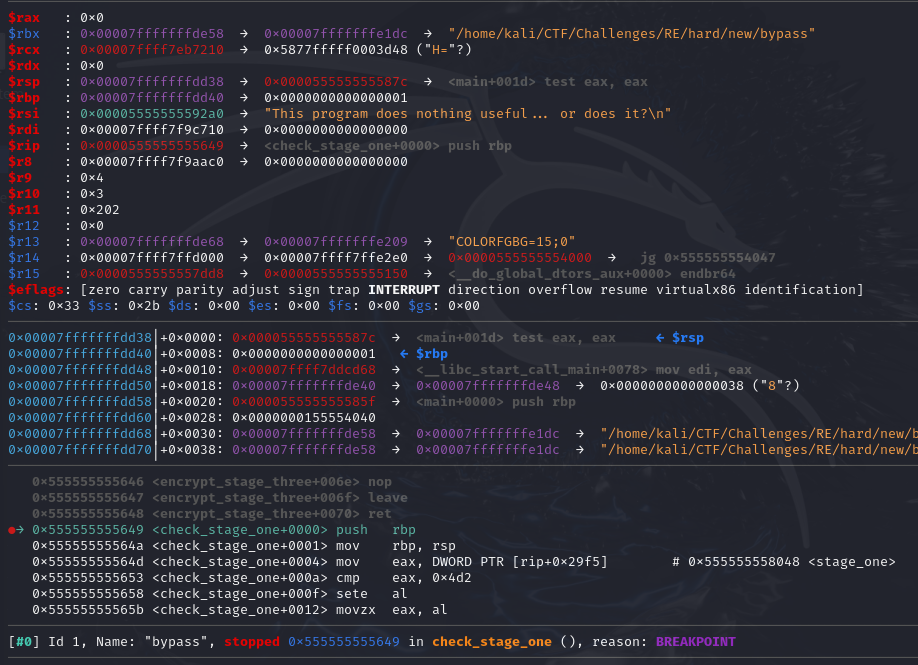
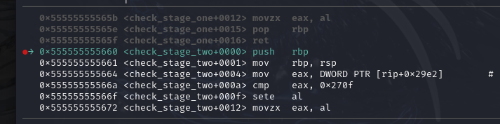
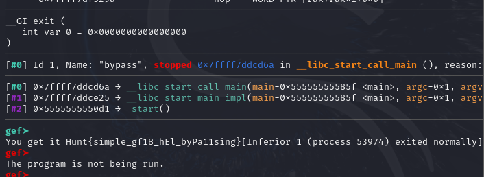

# Writeup

  

1. can use some dynamic anlysis to solve it such as gdb , ollydbg , x64 dbg . 

2. Now i will showing how to use gdb to solve it

3. 
```bash
gdb -q bypass
```

4. when enter gdb set a breakpoint at main , check_stage_one and reveal_flag and run it.

```gdb
b * main
b * check_stage_one
b * reveal_flag
r
```


5. now type c to reach the first breakpoint  

```bash
c
```

6. now u reach here and in order to bypass it u need to reach the cmp instruction and change the value of eax then press c to reach next breakpoint .

```gdb
ni
ni
ni
set $eax = 0x4d2
c
```




7. now u alrwady bypass the infinity while loop and now u need to set breakpoint for check_stage_two , check_stage_three and check_stage_four .

```gdb
b * check_stage_two
b * check_stage_three
b * check_stage_four
c
```

8. now u reach here 



9. now set the eax value to let it same with cmp value to bypass it and it is same in following condition checking . 

```gdb
ni
ni
ni
set $eax = 0x270f
c
ni
ni
ni
set $eax = 0x10e1
c
ni
ni
ni
set $eax = 0x22b8
```

10. now set a breakpoint at read_file and keep on ni until the program end the flag is shown 

```gdb
b * read_file
ni 
```

11. 


Hunt{simple_gf18_hEl_byPa11sing}
