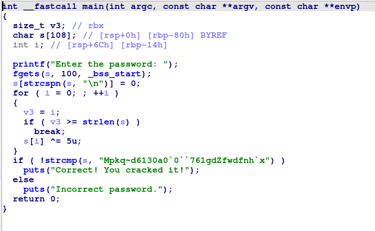
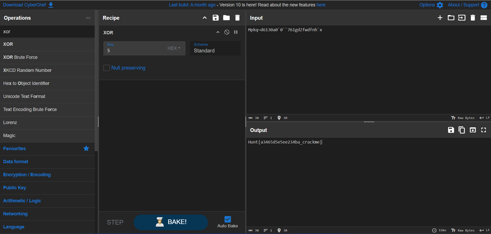

  

### Writeup 
1. open ida and load the file 

2. then click f5 to decompile it 



3. from the pseudocode we know that the s is storing our input and will undergo xor with 5 and compare , if equal then we cracked it .

4. now we do a simple script to solve it 
- Note : a ^b =c is equal to a ^ c = b 

```java
public class test{
    public static void main(String[] args) {
        String word ="Mpkq~d6130a0`0``761gdZfwdfnh`x";
        StringBuilder sb = new StringBuilder();
       for(int i=0;i<=word.length()-1;i++){
            char temp = (char)(word.charAt(i) ^5);
            sb.append(temp);

       }
       System.out.println(sb.toString());
    }
}
```

5. The flag 
Hunt{a3465d5e5ee234ba_crackme}


6. we can also use cyberchef

