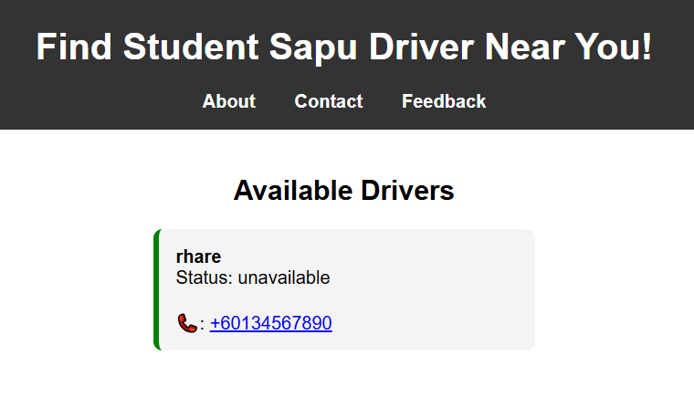
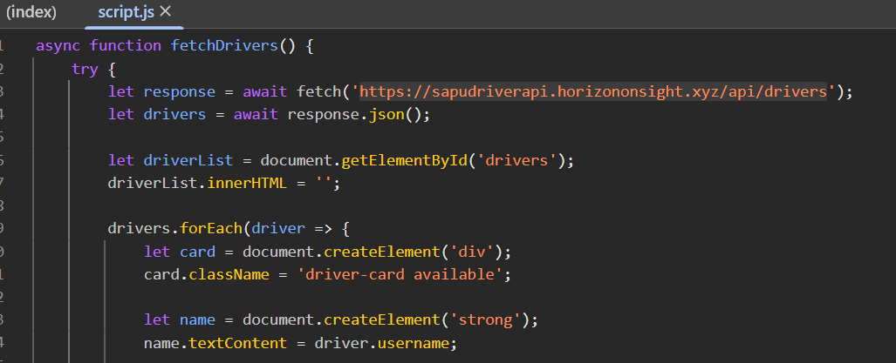
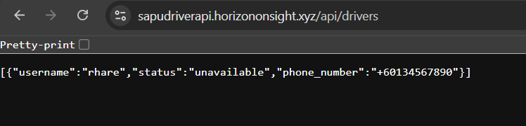
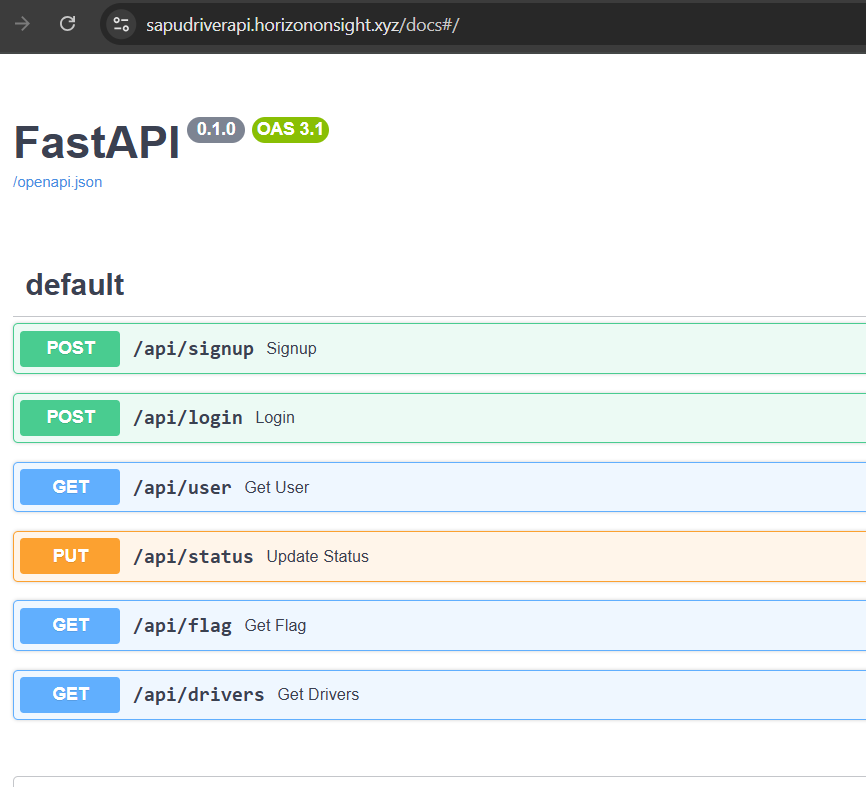
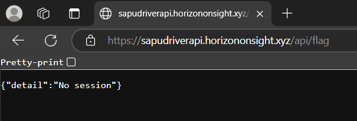
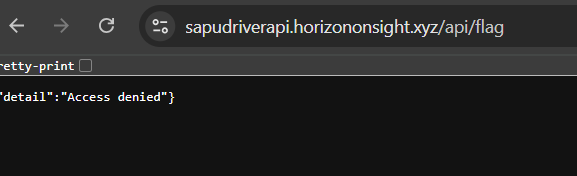
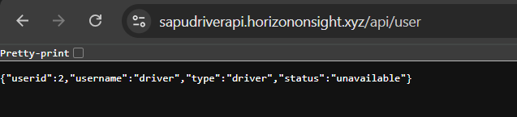
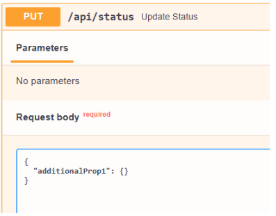
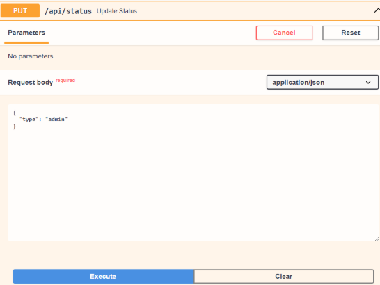
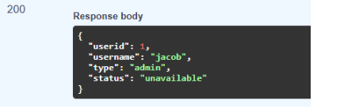

# Sapu Driver 

  


## Description


## Solution
Going to the given link https://sapudriver.horizononsight.xyz/ we landed on this page. Viewing the page source, there is script.js being used, that might be worth checking.



Inspecting the element (CTRL + SHIFT + i) >  Sources, we can see that the script is making api calls to an endpoint at https://sapudriverapi.horizononsight.xyz/api/drivers
  


browsing to the endpoint, we are returned with an array of json



Using the chrome extension Wappalyzer, we indentified that FASTapi is being used. 


FASTapi should have its default documentation page at /docs/

so browsing to https://sapudriverapi.horizononsight.xyz/docs/ we can see the available functions we can use




There is also a flag endpoint called /api/flag but when called it seems that we might require a session identifier.




We can try to call the api/signup/ using the fastapi doc page to create an account and it will be reflected on the main page https://sapudriver.horizononsight.xyz/

We can try the api/signup/ function as well using the username and password passed with the previous /api/signup call

browsing to /api/flag, we are greeted with a different message. this time "Access Denied"



So we might need to change our accounts privilege or find a workaround

when we try calling the /api/user

we noticed that we are given with an extra information, compared to the /api/drivers/. We are given a single json instead of an array, but there is a new found variable here, which is "userid" and "type"

That type might be an account type. Maybe the admin has a different type of account to manage this api and perform testing.




Further checking other api endpoints: PUT /api/status/ pose a red flag




Unlike the /api/login/ and /api/signup/, we are not given specific attribute to work with, such as in this case, supposed to be “status”

FastAPI uses Pydantic models to define request/response schemas. If you use something like this:

```python
from pydantic import BaseModel

class MyModel(BaseModel):
    class Config:
        extra = "allow"  # Allows additional properties not defined in the model

```

Or you define a model that accepts arbitrary keys and values:


``` python
from pydantic import BaseModel
from typing import Dict, Any

class FlexibleModel(BaseModel):
    __root__: Dict[str, Any]
```

Then the docs will auto-generate a sample that says:
 "Hey, this can accept random additional fields like 'additionalProp1'", and that's why it puts that placeholder.

If this PUT /api/status endpoint accepts arbitrary fields (like "type": "admin") and your backend doesn't restrict or sanitize them, we can potentially escalate our privilege and gain admin access

Lets check if we are admin by calling /api/users/



We managed to change our account to admin! Now lets call the /api/flag endpoint to retrieve the flag




Conclusion: Allowing arbitrary fields in API requests—like "type": "admin"—can lead to serious security vulnerabilities, including unauthorized privilege escalation. Always use strict Pydantic models with extra = "forbid" to ensure only intended fields are accepted. Validating input thoroughly is essential for maintaining data integrity and application security

