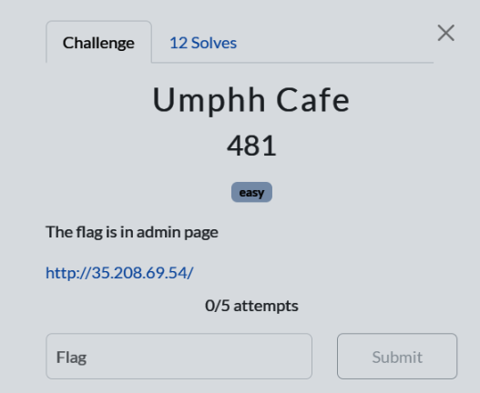
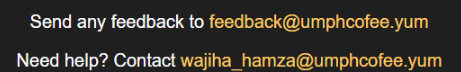
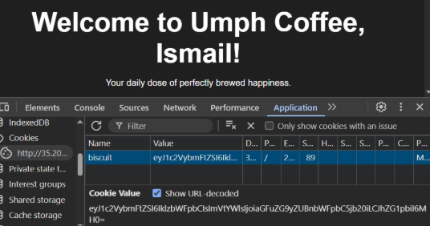
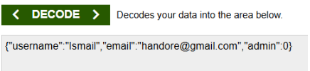
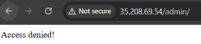
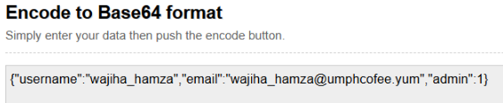
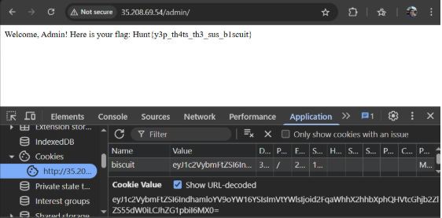

# Umphh Cafe

  

## Description

## Solution

A page for a Coffee shop.

At the bottom of the page we get two emails. Wajiha Hamza might be an admin or staff of this shop.

After registering an account, we are given a cookie name ‘biscuit’ with a string value that looks like a base64. The ‘=’ sign at the end of the string is commonly found in base64 encoding, used as a padding character.

Using online base64 decoder, we found out our cookie is actually consist of the following parameter

The description says that the flag is in the admin page. However access is denied

Since we know how the cookies is decoded we can easily craft our own cookie to imitate a possible admin account

You can try changing the admin value to 1 but still can’t bypass the admin check. Maybe the server checks for a valid admin username and email as well. Assuming that Wajiha Hamza is an admin and uses predictable username, (same one as her email username, ie wajiha_hamza), we can also try using that username.

Encoding this to base64 would give
eyJ1c2VybmFtZSI6IndhamloYV9oYW16YSIsImVtYWlsIjoid2FqaWhhX2hhbXphQHVtcGhjb2ZlZS55dW0iLCJhZG1pbiI6MX0=

Changing our cookie value to our new illegally forged admin cookie, you will be able to bypass the admin page. And retrieve the flag.

Conclusion:
A cookie is a small piece of data stored locally in our browser, often used to maintain session information. To prevent tampering or impersonation, cookies, especially those storing sensitive data like session tokens should be encrypted or signed. However, if the encryption or signing method is predictable or improperly implemented, the cookie becomes vulnerable to attacks such as forgery or session hijacking.
For a deeper understanding of secure cookie handling, consider reading about HMAC (Hash-based Message Authentication Code) for signing cookies, and explore common pitfalls in JWT (JSON Web Token) implementation.

